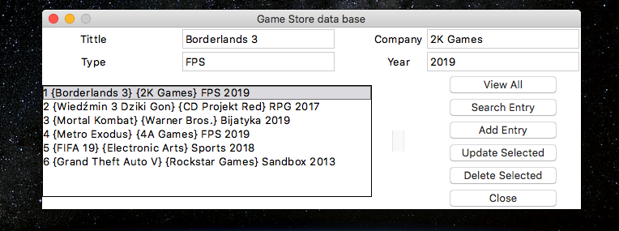

Relased date: 2019

GameStore is an window app based on ***Tkinter*** and ***SQLite3*** frameworks. User can enter 4 parameters to describe any game and create database from them.
There are also 5 button functions which user can use to insert, update and delete parameters or whole tupels.

Screenshot below:

